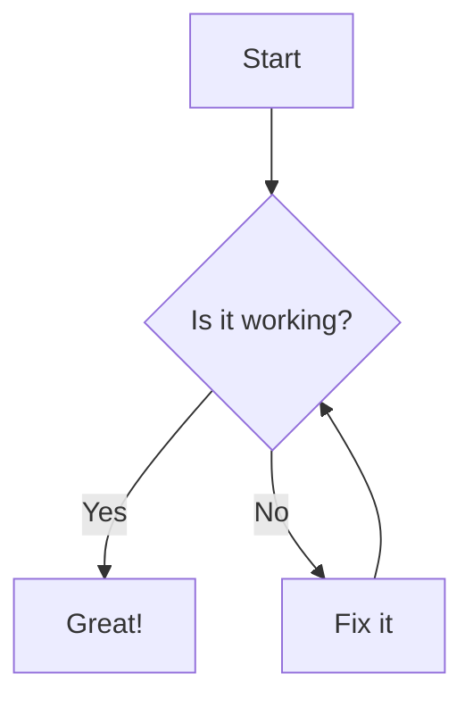
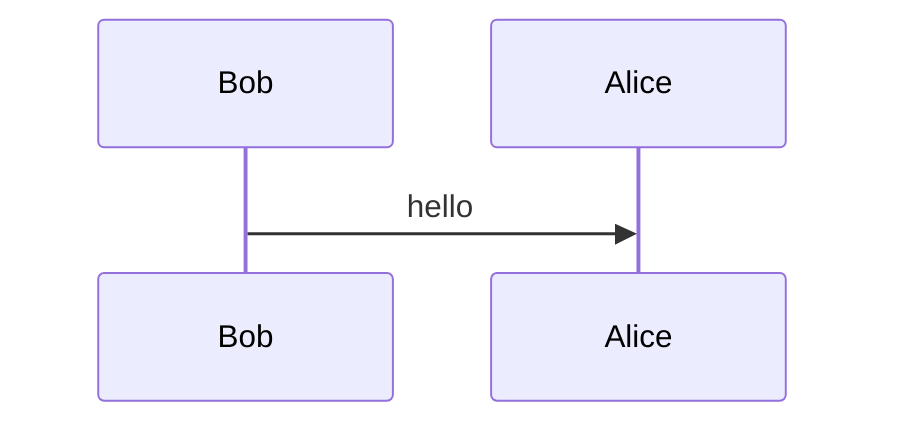

# Diagram Examples

## Flowcharts mermaid

```mermaid
graph TD
    A[Start] --> B{Is it working?}
    B -- Yes --> C[Great!]
    B -- No --> D[Fix it]
    D --> B
```

## PlantUML Diagram in Mermaid

```mermaid
sequenceDiagram
    participant Bob
    participant Alice
    Bob ->> Alice: hello
```